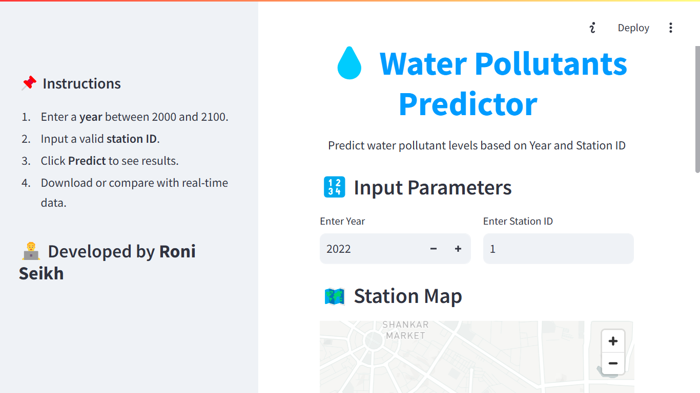
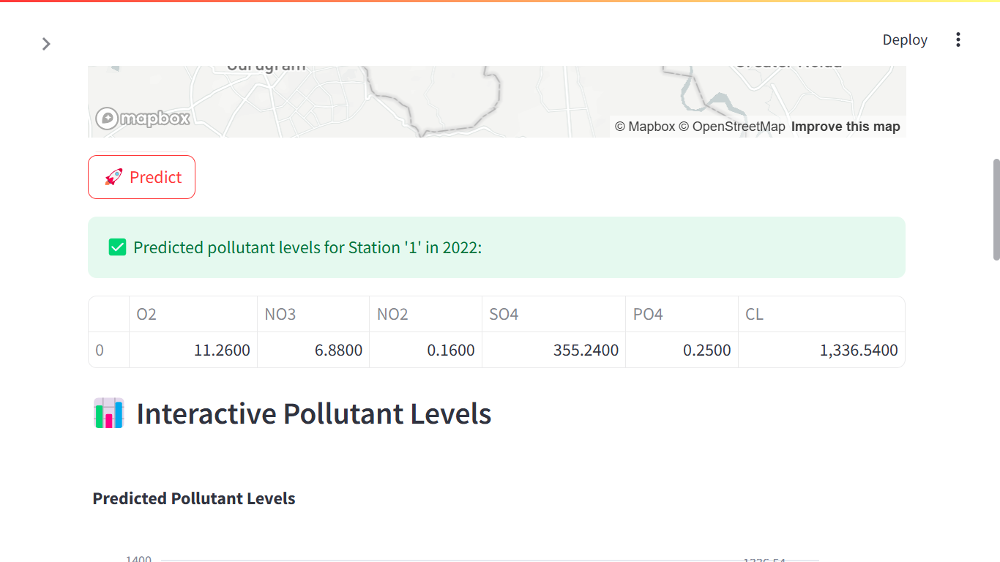
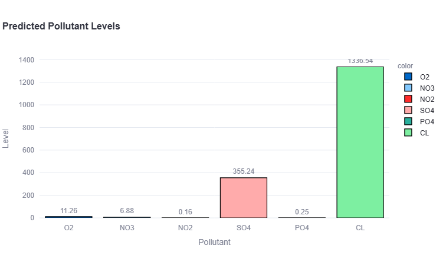

# 💧 Water Pollutants Predictor – AICTE x Shell Virtual Internship 🌱

[](https://internship.aicte-india.org/)
[](https://www.python.org/)
[](LICENSE)

A machine learning web application built to **predict multiple water quality parameters** based on **Year** and **Station ID** input. Developed under the **Shell-Edunet-AICTE Internship on Green Skills & AI** during **June 2025**.

> 🌐 **Live Project Repo:** [Water Pollutants Predictor](https://github.com/Roni-Seikh/Water-Pollutants-Predictor.git)

---

## 📸 Project Screenshots

| Home Page With Input |
|-------------|
|  |

| Sidebar |
|-------------|
|  |

| Prediction |
|-------------|
|  |

| Predicted vs Real-Time |
|-------------|
|  |

| Comparison with Real Data |
|-------------|
|  |

| Download Results |
|-------------|
|  |

| NewPlot |
|-------------|
|  |

| Station Map |
|-------------|
|  |

---

## 📌 Project Overview

Access to clean water is essential for life. This project uses **multi-output regression** to predict **six major water pollutants** from historical data, making it easier for environmental bodies to monitor, alert, and act on water quality issues.

### 🎯 Key Features

- 📅 Predict pollutant levels based on **Year** & **Station ID**
- 📊 Visualize results with **interactive charts**
- 🔁 Compare model predictions with **simulated real-time data**
- 🌍 View station locations on an interactive **map**
- 💾 Download results as **CSV**
- 🧠 Powered by **Random Forest + MultiOutputRegressor**
- 🌐 Clean and responsive **Streamlit UI**

---

## 🧪 Predicted Water Quality Parameters

The application predicts the following:

- O₂ (Dissolved Oxygen)
- NO₃ (Nitrate)
- NO₂ (Nitrite)
- SO₄ (Sulfate)
- PO₄ (Phosphate)
- CL (Chloride)

---

## 🧰 Technologies Used

| Technology | Purpose |
|------------|---------|
| **Python 3.12** | Core programming |
| **Streamlit** | Web app development |
| **Pandas, NumPy** | Data preprocessing |
| **Scikit-learn** | ML modeling |
| **Matplotlib, Plotly** | Visualization |
| **Joblib** | Model serialization |

---

## 🚀 How to Run Locally

```bash
# Clone the repo
git clone https://github.com/Roni-Seikh/Water-Pollutants-Predictor.git
cd Water-Pollutants-Predictor

# Create virtual environment & activate it
python -m venv venv
source venv/bin/activate  # For Windows: venv\Scripts\activate

# Run Streamlit app
streamlit run app.py
```

---

## 🎓 Internship & Timeline

This project was developed as part of:

- 🏛 **Internship**: Shell-Edunet Skills4Future AICTE Virtual Internship  
- 🧑‍💻 **Intern**: Roni Seikh  
- 🪪 **AICTE Student ID**: STU67399a6e56fbd1731828334  
- 🆔 **Internship ID**: INTERNSHIP_1746416864681834e0e35d8  
- 📅 **Duration**: June 16 – July 16, 2025 (4 weeks)  
- 🎯 **Focus**: Green Skills & AI in Environmental Monitoring  
- 🎓 **Organized by**: AICTE, Shell & Edunet Foundation

---

## 📈 Model Performance

The model was evaluated using:

- ✔️ **R² Score**
- ✔️ **Mean Squared Error (MSE)**
- ✔️ Good predictive accuracy across pollutants

> 🔗 **Model File**:  
[Download Pollution Model (Google Drive)](https://drive.google.com/file/d/18RJzu35vyuMgpcAE590u1IaDvHY3-SWq/view?usp=sharing)

---

## 🧑‍💼 Developer Info

```plaintext
👨‍💻 Roni Seikh  
🎓 AICTE Virtual Intern | Shell-Edunet Foundation  
🌐 GitHub: https://github.com/Roni-Seikh  
📁 Project Repository: Water-Pollutants-Predictor  
```

---

## 📝 License

This project is open-source under the **MIT License**.

---

## 🙏 Acknowledgements

- **AICTE (All India Council for Technical Education)**
- **Shell Foundation**
- **Edunet Foundation**
- **Project Mentors & Industry Experts**

> *“Creating sustainable solutions with the power of Artificial Intelligence.”*